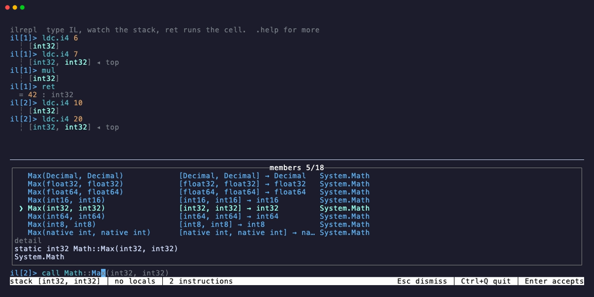

The prompt is an editor. Enter sends a line whose braces balance and continues one whose braces
are open, so a method or a class is typed in one go. Each new line copies the indentation of the
line before it and steps in after an opening brace; a closing brace typed on a blank line steps
out. The status bar says what Enter will do next.

```ilrepl
il[1]> .method int32 Twice(int32 n) {
  ...>   ldarg n
  ...>   ldc.i4 2
stack [] │ no locals │ 0 instructions │ editing 3 lines          Enter continues
```

Once the braces balance the hint changes, and Enter sends the block line by line. The transcript
keeps every echo and every stack line, the same as if each line had been typed on its own.

```ilrepl
il[1]> .method int32 Twice(int32 n) {
  ...>   ldarg n
  ...>   ldc.i4 2
  ...>   mul
  ...>   ret
  ...> }
stack [] │ no locals │ 0 instructions │ editing 6 lines      Enter sends 6 lines
```

```ilrepl
il[1]> .method int32 Twice(int32 n) {
  method int32 Twice(int32 n)
il[1]>   ldarg n
  ┊ [int32]
il[1]>   ldc.i4 2
  ┊ [int32, int32] ◂ top
il[1]>   mul
  ┊ [int32]
il[1]>   ret
  ┊ []
il[1]> }
  end of method Twice
il[2]> ldc.i4 21
  ┊ [int32]
il[2]> call int32 Twice(int32)
  ┊ [int32]
il[2]> ret
  = 42 : int32
```

Up and Down move through the lines of the buffer and reach history only from its first and last
line; Ctrl+P and Ctrl+N walk history from any line. Shift with the arrows selects inside the
buffer, typing replaces the selection, and on the desktop Ctrl+C copies it. Ctrl+C with nothing
selected clears the buffer, and on an empty buffer it quits.

## Pasting

A paste lands in the editor and waits for Enter, so the block below, from
[Methods](/usage/methods/), can be checked before it goes.

```ilrepl
  ...>   ldc.i4 2
  ...>   sub
  ...>   call int32 Fib(int32)
  ...>   add
  ...>   ret
  ...> BASE: ldarg n
  ...>   ret
  ...> }
stack [] │ no locals │ 0 instructions │ editing 17 lines    Enter sends 17 lines
```

The excerpt above shows the last rows of the pasted Fibonacci method. The editor shows the rows that fit, up to a third of the screen, and scrolls to keep the
caret in view. Only the newline the clipboard adds at the end is dropped; every other blank line
is yours. Inside a block a blank line is skipped, at the top level it runs the cell, as it does
when typed, and a line that is only a comment is echoed and ignored. Pasted text keeps its own
indentation.

## A refused line

When the engine refuses a line, the block it belongs to is withdrawn, the method or class it
opened is abandoned, and the whole block comes back with the refused line selected. A line on
its own is not put back: the error is in the transcript and Up recalls the line. In a paste of
separate lines, the ones after the refused line never went, and they come back.

```ilrepl
il[3]> .method int32 Half(int32 n) {
  method int32 Half(int32 n)
il[3]>   ldarg n
  ┊ [int32]
il[3]>   lcd.i4 2
  error: unknown opcode 'lcd.i4' (did you mean 'ldc.i4'?)
  method Half abandoned; the block is back in the editor
```

```ilrepl
il[3]> .method int32 Half(int32 n) {
  ...>   ldarg n
  ...>   lcd.i4 2
  ...>   div
  ...>   ret
  ...> }
stack [] │ no locals │ 0 instructions │ editing 6 lines      Enter sends 6 lines
```

Typing replaces the selected line, and the next Enter sends the block again from a clean state.
Ctrl+C on a returned block clears it; the engine was already put back. A block that has already
run or committed cannot be withdrawn: a cell that throws stays run and only the lines after it
come back, and a `.undo`, `.clear`, or `.reset` inside a block moves the point a later refusal
returns to, which the transcript notes.

```ilrepl
il[3]> .method int32 Half(int32 n) {
  method int32 Half(int32 n)
il[3]>   ldarg n
  ┊ [int32]
il[3]>   ldc.i4 2
  ┊ [int32, int32] ◂ top
il[3]>   div
  ┊ [int32]
il[3]>   ret
  ┊ []
il[3]> }
  end of method Half
```

Ctrl+C while a block is going by waits for the line in flight, withdraws the block, and leaves
its text in the editor. A block whose last line has already been accepted stays.

## Comments and blank lines

A comment is removed before a line is read, wherever the line is, so a command inside a comment
is text. A line that is only a comment is echoed and ignored, and a blank line at the top level
runs the cell.

```ilrepl
il[4]> ldc.i4 7
  ┊ [int32]
il[4]> // kept on the stack
il[4]>
  = 7 : int32
```

An unterminated `/*` keeps the buffer open, and the comment ends where `*/` does, lines later.

```ilrepl
il[5]> /* a note
  ...>
stack [] │ no locals │ 0 instructions │ editing 2 lines          Enter continues
```

```ilrepl
il[5]> /* a note
il[5]> that goes on */ ldc.i4 3
  ┊ [int32]
il[5]> ret
  = 3 : int32
```

## History

Every submission is one history entry, a refused block and its corrected version each on their
own, and Up brings a block back whole with the caret at its end.

```ilrepl
il[6]> .method int32 Half(int32 n) {
  ...>   ldarg n
  ...>   lcd.i4 2
  ...>   div
  ...>   ret
  ...> }
stack [] │ no locals │ 0 instructions │ editing 6 lines      Enter sends 6 lines
```

History is kept between runs in `~/.config/ilrepl/history`, or under `$XDG_CONFIG_HOME` when
that is set, and under `LocalApplicationData` on Windows. The file is the one pgcli writes: a
`#` line with the time, then each line of the entry after a `+`. It is only ever appended to,
under a lock file beside it, so two sessions never write over each other; the newest thousand
entries are loaded. `--no-history` runs without it. In the browser the live session keeps its
history in the browser's own database, which every tab shares.

## Completion

Completion reads what you have written earlier in the buffer, including method parameters and
types that have not been submitted yet.

While new matches are being checked, the previous rows stay dimmed under an `updating` title.
They cannot be accepted until the new results arrive.
If running code loads another assembly in the background, the prompt refreshes its suggestions
without an edit. Types whose short names become ambiguous are offered with qualified names.

The palette shows each overload with its stack effect and full signature:



Inside a method, type `call Ma`, complete `Math`, then type `Ma` after the inserted `::`.
Use Down to select the overload taking two `int32` values. The [Quick start recording](/getting-started/quick-start/)
shows Tab completion in a running session.

Tab inserts the selected signature. Here is the finished block and a call to it, starting with
`.reset` to clear the earlier examples:

```ilrepl
il[6]> .reset
  cell, declarations, methods, and types cleared
il[6]> .method int32 Larger(int32 a, int32 b) {
  method int32 Larger(int32 a, int32 b)
il[6]>   ldarg a
  ┊ [int32]
il[6]>   ldarg b
  ┊ [int32, int32] ◂ top
il[6]>   call Math::Max(int32, int32)
  ┊ [int32]
il[6]>   ret
  ┊ []
il[6]> }
  end of method Larger
il[7]> ldc.i4 6
  ┊ [int32]
il[7]> ldc.i4 7
  ┊ [int32, int32] ◂ top
il[7]> call Larger
  ┊ [int32]
il[7]> ret
  = 7 : int32
```

Generic definitions continue argument by argument. Complete `call Array::Empt` to
`call Array::Empty<`; the palette names argument 1 of 1, `T`. Complete `str` to `string`,
type `>`, then Tab inserts `()`. The resulting `call Array::Empty<string>()` binds the
definition you selected. Nested generic arguments retain their outer selection while you edit.

## Colours

One tokenizer lights the buffer, the echo, and the listings from `.show`, `.dis`, and `.il`, so
a line reads the same everywhere it appears. Opcodes, directives, commands, keywords, types,
members, strings, numbers, labels, and comments each have a colour, and a first word the engine
would refuse is underlined before Enter is pressed.
